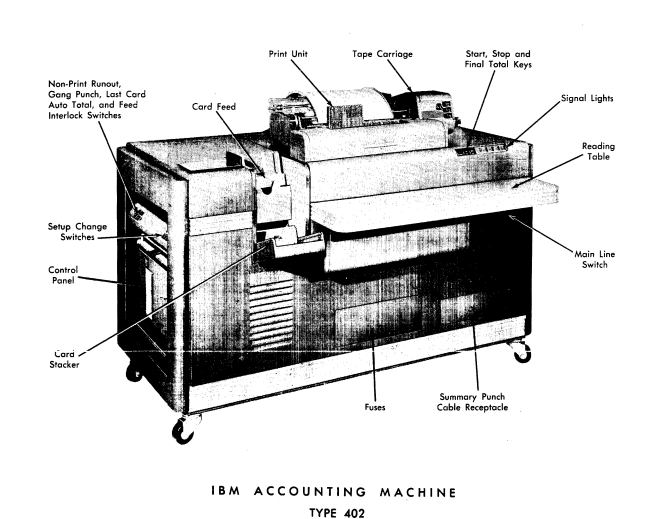

# History of the IBMi


This section will be an attempt to lightly describe the history of this machine without boring the reader too much.

<br>

<p align="center">
(From <a href= "http://www.bitsavers.org/pdf/ibm/punchedCard/AccountingMachine/224-1614-13_402-403-419.pdf">IBM 402, 403, and 419 Account Machines Manual</a>)
</p>


## IBMi Ancestry

**History of Punched-Card IBM Machines**:
* 1880 **Hollerith Census Tabulator** → Only capable of counting
* 1928 **Hollerith Type IV Tabulator** → First appearance of 80-column card
* mid 1930s-1950s **IBM 400 series accounting machines**
* 1959 **IBM 1400 series** → RPG I
* 1969-1977 **IBM System/3** → RPG II, First appearance of 96-column card
* 1978 **IBM System/38** → RPG III
* 1988 **Application System/400 (AS/400)** → RPG 400/IV
* 2000 iSeries (renamed from AS/400)
* 2006 System i (renamed from iSeries)
* 2008 IBM Power Systems generation replaces IBM System i

The naming of the IBMi gets a little confusing when you google things. You'll see IBMi, AS/400, iSeries, IBM System i, etc.
**All that said, I will refer to the box as the IBMi from here onwards.**


## RPG's Evolution


96-column card (From eschlaep on [flickr](https://www.flickr.com/photos/tubetime/3492103709/in/photostream/))
<br><br>

**Report Program Generator** (RPG) was developed to replicate punching 80-column cards on the IBM 1400 series as 
a programming language used for generating reports. Understandably the language is columnar and looks pretty gross as a result.

As time went on and the IBMi (AS/400) evolved, the language evolved with it. It gained various features and improvements along with
the system it ran on. The current version of RPG (RPGIV) allows for "free-format" code, breaking its ties to its columnar ancestors.
Modern RPGIV can be considered a general purpose programming language, although I'd be careful who you said that to.

In this book, I will briefly go over fixed-format RPG. But, the main focus will be on either completely free-format
or mixed format.


#### Hello World in fixed-format RPG III
```
      C                     MOVEL'HELLO'   HELLO  11
      C                     MOVE 'WORLD'   HELLO
      C           HELLO     DSPLY          WAIT    1
      C                     SETON                     LR
```

#### Hello world in fixed-format RPG IV
```
      C     'Hello World' DSPLY
      C                   SETON                                        LR
```

#### Hello world in free-format RPG IV
```
       /free
        dsply ('Hello World');
        *inlr = *on
```

<br>
As you can see, free-format RPG IV looks pretty readable. I think its worthwhile to be able to read fixed-format RPG III. But,
a majority of effort should be put on RPG IV free and mixed-format.

<br>

## References / Additional Reading
* Columbia University Computing History - http://www.columbia.edu/cu/computinghistory/
  * Hollerith Census Tabulator - http://www.columbia.edu/cu/computinghistory/census-tabulator.html
  * IBM 402 - http://www.columbia.edu/cu/computinghistory/402.html
* Tabulating Machine - https://en.wikipedia.org/wiki/Tabulating_machine
* IBM Accounting Machine Manual - http://www.bitsavers.org/pdf/ibm/punchedCard/AccountingMachine/224-1614-13_402-403-419.pdf


